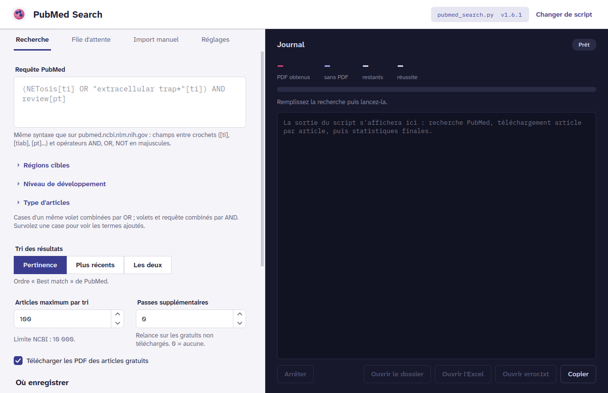
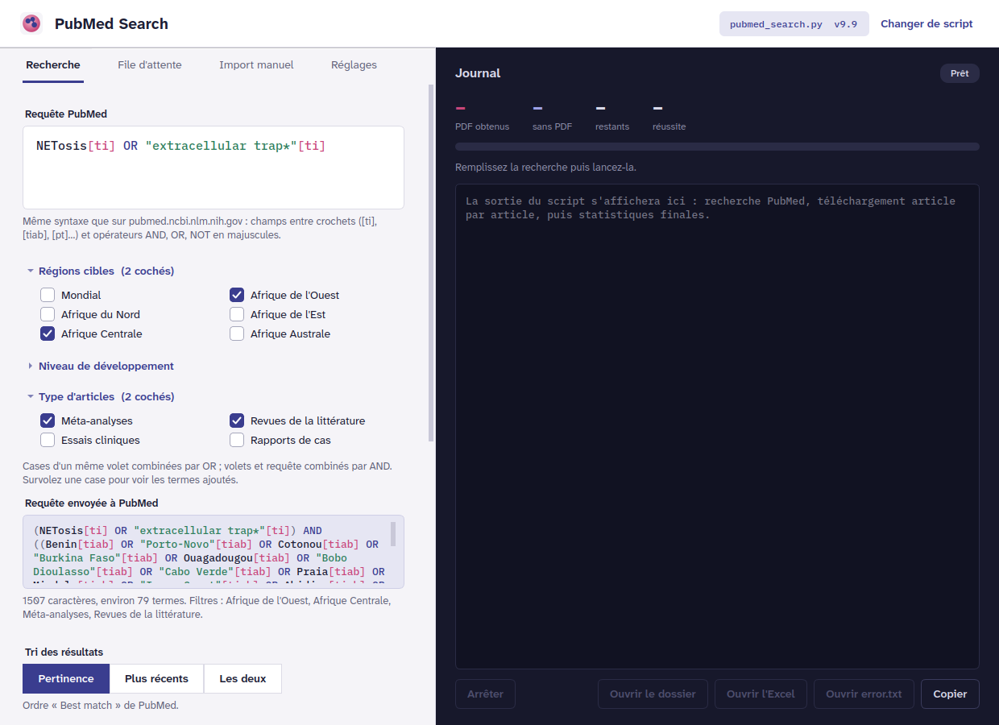
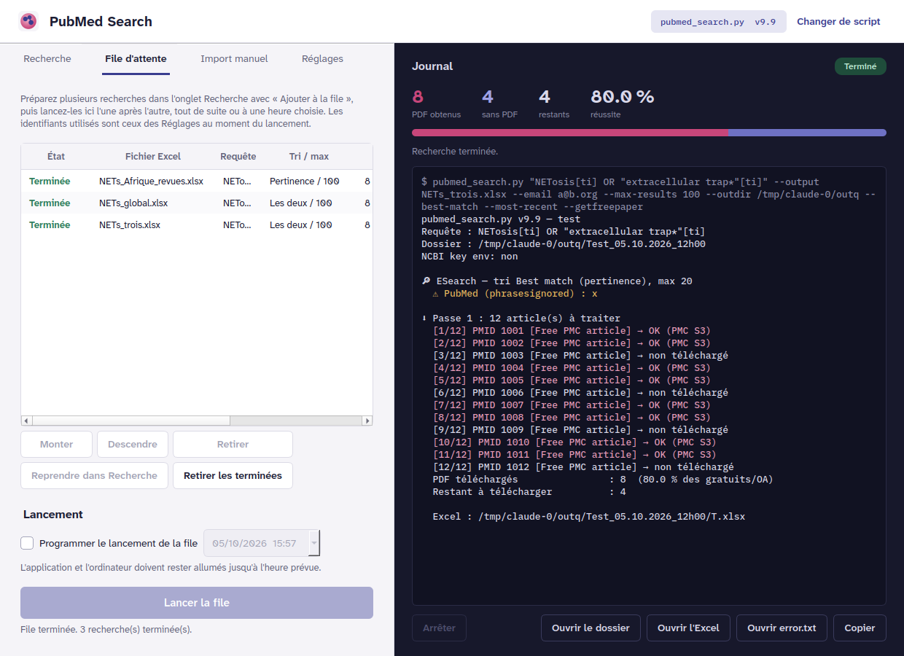

# PubMed Search

Rechercher dans PubMed et télécharger automatiquement les PDF des articles en libre accès,
avec un tableau Excel récapitulatif. Application de bureau pour **Windows 10 / 11**,
**macOS 12+ (Apple Silicon et Intel)** et **Linux (Ubuntu, Debian, Mint)**, avec une extension **Firefox** qui envoie une recherche
PubMed vers l'application en un clic.



## Télécharger

Page des téléchargements : **[Dernière version](https://github.com/sergesawadogo/pubmed-search/releases/latest)**

| Fichier | Pour |
|---|---|
| `PubMedSearch-Setup-1.2.0.exe` | Windows 10 et 11 (64 bits) |
| `PubMedSearch-1.2.0-macOS-AppleSilicon.dmg` | Mac à puce Apple (M1, M2, M3, M4…), macOS 12 Monterey ou plus récent |
| `PubMedSearch-1.2.0-macOS-Intel.dmg` | Mac à processeur Intel, macOS 12 Monterey ou plus récent |
| `pubmed-search-gui_1.2.0_amd64.deb` | Ubuntu 20.04+, Debian 10+, Linux Mint 20+ (64 bits) |
| `envoyer-vers-pubmed-search-1.0.0.xpi` | Extension Firefox (facultative) |
| `SHA256SUMS.txt`, `SHA256SUMS-macOS.txt` | Empreintes pour vérifier les fichiers |

Rien d'autre à installer : Python et ses bibliothèques sont inclus dans l'application.

---

## Installation

### Windows 10 / 11

1. Téléchargez `PubMedSearch-Setup-1.2.0.exe` et double-cliquez dessus.
2. Windows affiche « Windows a protégé votre ordinateur » : l'installateur n'est pas signé
   numériquement. Cliquez sur **Informations complémentaires**, puis **Exécuter quand même**.
3. Acceptez la demande d'autorisation administrateur, choisissez le dossier, terminez.
4. Lancez **PubMed Search** depuis le menu Démarrer (ou le Bureau si vous avez coché l'option).

Désinstallation : Paramètres → Applications → PubMed Search → Désinstaller.
Vos réglages (`%LOCALAPPDATA%\pubmed-search-gui`) sont conservés.

### macOS (Apple Silicon ou Intel)

1. Quel fichier ? Menu  → **À propos de ce Mac** : « Puce Apple M… » → fichier
   `…-AppleSilicon.dmg` ; « Processeur Intel… » → fichier `…-Intel.dmg`.
2. Ouvrez le `.dmg` et glissez **PubMed Search** sur le dossier **Applications**.
3. Premier lancement : l'application n'est pas signée par un certificat Apple ni notariée,
   macOS la bloque (« Apple ne peut pas vérifier… »). Cliquez sur **OK**, puis ouvrez
   **Réglages Système → Confidentialité et sécurité**, descendez jusqu'au message concernant
   PubMed Search et cliquez sur **Ouvrir quand même** (mot de passe demandé). Les fois
   suivantes, elle s'ouvre normalement.
   Alternative dans le Terminal :
   `xattr -dr com.apple.quarantine "/Applications/PubMed Search.app"`
4. Les liens `pubmedsearch://` de l'extension Firefox fonctionnent une fois l'application
   lancée au moins une fois depuis le dossier Applications.

Désinstallation : glissez **PubMed Search** du dossier Applications vers la Corbeille.
Vos réglages (`~/Library/Preferences/pubmed-search-gui`) sont conservés.

### Linux (Ubuntu, Debian, Linux Mint)

```bash
cd ~/Téléchargements
sudo apt install ./pubmed-search-gui_1.2.0_amd64.deb
```

`apt` installe aussi les bibliothèques graphiques nécessaires. Lancez **PubMed Search**
depuis le menu des applications, ou `pubmed-search-gui` dans un terminal.

Désinstallation : `sudo apt remove pubmed-search-gui`.

### Extension Firefox (facultative)

L'extension ajoute un bouton **Envoyer vers PubMed Search** sur pubmed.ncbi.nlm.nih.gov.
Elle n'est pas encore signée par Mozilla, ce qui limite son installation :

- **Firefox classique** : installation temporaire, à refaire après chaque redémarrage de Firefox.
  Tapez `about:debugging` dans la barre d'adresse → **Ce Firefox** →
  **Charger un module complémentaire temporaire…** → choisissez le fichier `.xpi`.
- **Firefox Developer Edition, Nightly ou ESR** : installation permanente.
  Dans `about:config`, passez `xpinstall.signatures.required` à `false`, puis glissez le
  fichier `.xpi` dans une fenêtre Firefox et confirmez.

Au premier envoi, Firefox demande quelle application doit ouvrir les liens
« pubmedsearch » : choisissez **PubMed Search** et cochez « Toujours utiliser ».

---

## Premier démarrage

Ouvrez l'onglet **Réglages** :

1. **Email** (obligatoire) : NCBI et Unpaywall demandent une adresse de contact.
2. **Clé API NCBI** (recommandée, gratuite) : 10 requêtes par seconde au lieu de 3.
   Créez-la sur [ncbi.nlm.nih.gov](https://www.ncbi.nlm.nih.gov/account/) → Account settings
   → API Key Management.
3. **Clé API CORE** (facultative) : copies d'articles dans les dépôts d'universités.
   Gain modeste, recherches plus lentes.
4. Cochez **Mémoriser les clés API** pour ne pas les saisir à chaque fois. Elles sont alors
   enregistrées en clair dans le fichier de réglages de votre ordinateur, et ne sont jamais
   écrites dans le journal ni dans les fichiers de résultats.

---

## Utilisation

### Lancer une recherche

1. **Requête PubMed** : même syntaxe que sur le site, par exemple
   `(NETosis[ti] OR "extracellular trap*"[ti]) AND review[pt]`.
2. **Filtres** (facultatifs, volets dépliables) : *Régions cibles*, *Niveau de développement*,
   *Type d'articles*. Plusieurs cases d'un même volet sont combinées par OR ; les volets entre
   eux et avec votre requête par AND. La requête complète envoyée à PubMed s'affiche en dessous.
3. **Tri** : Pertinence, Plus récents, ou Les deux (les deux listes sont fusionnées et le
   journal indique les articles propres à chacune).
4. **Articles maximum par tri** (limite NCBI : 10 000) et **passes supplémentaires**
   (relances sur les articles gratuits non téléchargés ; 0 par défaut).
5. **Dossier de destination** (bouton *Nouveau dossier…* pour le créer) et **nom du fichier
   Excel**.
6. **Lancer la recherche**. Le journal à droite affiche la progression ; **Arrêter** interrompt
   proprement (les résultats déjà obtenus sont enregistrés).



### Ce que vous obtenez

Un dossier `NomExcel_JJ.MM.AAAA_HHhMM` contenant :

| Fichier | Contenu |
|---|---|
| `NomExcel.xlsx` | Onglet *Articles* : PMID, DOI, titre, type, auteurs, emails, gratuité, lien vers le PDF. Onglet *Résumé* : requête, nombre de résultats, taux de réussite, sources, durée. |
| `PDF_NomExcel/` | Les PDF, nommés `PMID-Auteur_Initiales(Année).pdf` |
| `NomExcel_PMID_tous.txt` | Tous les PMID, séparés par des virgules |
| `NomExcel_PMID_sans_pdf.txt` | Les PMID sans PDF |
| `error.txt` | Pour chaque article gratuit non obtenu : les causes et un lien à ouvrir à la main |

### File d'attente

Préparez plusieurs recherches avec **Ajouter à la file** (onglet Recherche), puis lancez-les
l'une après l'autre depuis l'onglet **File d'attente**, tout de suite ou à une date et une
heure choisies. L'application et l'ordinateur doivent rester allumés jusqu'à l'heure prévue.
La file est conservée quand vous fermez l'application.



### Depuis Firefox

Faites votre recherche sur pubmed.ncbi.nlm.nih.gov, avec les filtres de la colonne de gauche
si vous le souhaitez, puis :

- cliquez sur **Envoyer vers PubMed Search** sous la barre de recherche ; ou
- cliquez sur l'icône de l'extension pour modifier la requête, le tri et le nombre d'articles,
  puis choisissez **Remplir le formulaire**, **Ajouter à la file** ou **Lancer la recherche** ; ou
- sélectionnez un texte sur n'importe quelle page → clic droit → **Envoyer « … » vers PubMed Search**.

Filtres PubMed convertis automatiquement : types d'articles (revue, revue systématique,
méta-analyse, essai contrôlé randomisé, essai clinique, cas cliniques), années, « 1/5/10
dernières années », texte intégral gratuit, résumé disponible, langue, humains/animaux, sexe,
exclusion des preprints. Les autres filtres sont signalés dans la fenêtre de l'extension pour
que vous les ajoutiez à la main.

### Compléter à la main les PDF manquants

Environ 80 % des articles gratuits sont obtenus automatiquement. Les autres sont protégés
par les éditeurs ou par PMC contre les téléchargements automatisés, mais restent lisibles
dans votre navigateur :

1. Onglet **Import manuel** → choisissez le dossier de résultats → **Ouvrir les 10 premiers
   liens** (puis les suivants).
2. Enregistrez chaque PDF dans un dossier réservé à cet usage.
3. Choisissez ce dossier puis cliquez sur **Importer les PDF** : ils sont reconnus (DOI,
   titre ou PMID dans le nom du fichier), renommés, rangés et ajoutés à l'Excel.

---

## Questions fréquentes

**Pourquoi certains articles « gratuits » ne sont-ils pas téléchargés ?**
L'application n'utilise que les voies d'accès autorisées : stockage officiel de PMC sur
Amazon S3, Europe PMC, Unpaywall, HAL, CORE et sites des éditeurs. Le site web de PMC
interdit le téléchargement automatisé, et beaucoup d'éditeurs (Wiley, Elsevier, OUP…)
bloquent les programmes. Le fichier `error.txt` donne pour chaque article la cause et le lien
à ouvrir vous-même.

**Puis-je modifier les filtres (régions, types d'articles) ?**
Oui : Réglages → **Modifier les filtres…** ouvre le fichier `filtres.json` ; redémarrez
l'application après l'avoir enregistré. Attention aux termes ambigus : `Guinea[tiab]` trouve
aussi « guinea pig », `global[tiab]` est très fréquent hors contexte géographique.

**Le script de recherche peut-il évoluer sans réinstaller l'application ?**
Oui : Réglages → **Choisir…** permet d'utiliser une autre version de `pubmed_search.py`
(dossier `script/` de ce dépôt).

**Utilisation responsable.** Respectez les conditions d'utilisation de NCBI (E-utilities),
de PMC et des éditeurs, et le droit d'auteur des articles téléchargés.

---

## Contenu du dépôt

| Dossier | Contenu |
|---|---|
| `script/` | `pubmed_search.py`, utilisable seul en ligne de commande (`python3 pubmed_search.py --help`) |
| `interface/` | Application de bureau (PySide6) et fichiers de construction des installateurs |
| `extension-firefox/` | Code de l'extension Firefox |
| `docs/` | Procédure d'import manuel, captures d'écran |

Construction des installateurs : voir [`interface/README.md`](interface/README.md).

Licence : [MIT](LICENSE). Polices Atkinson Hyperlegible Next et IBM Plex Mono sous licence
SIL Open Font License.
